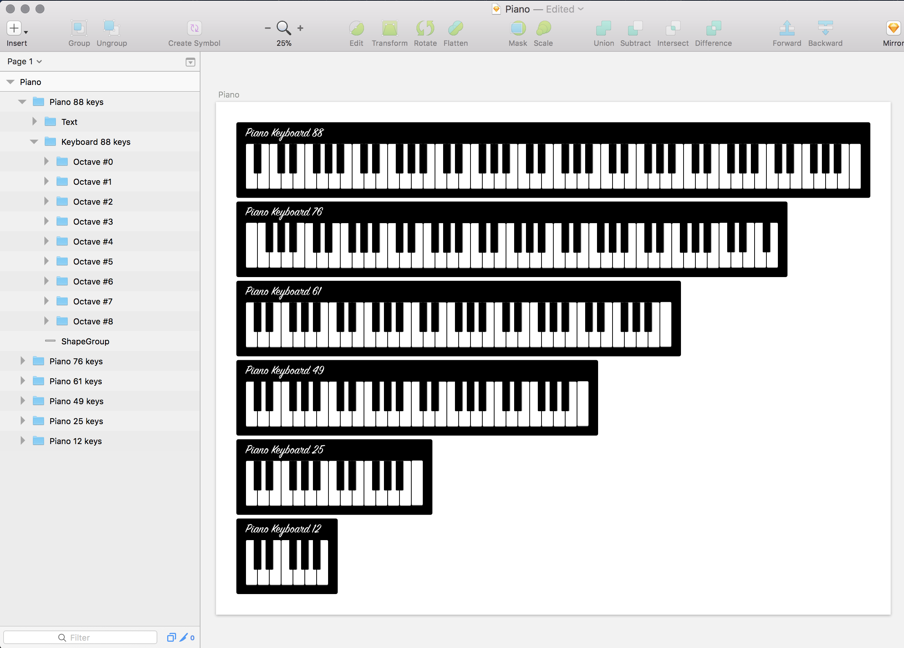

# react-sketch-piano

<div align="center">
  
</div>

Renders different Piano keyboard layouts to Sketch with [airbnb/react-sketchapp](https://github.com/airbnb/react-sketchapp).

## Get started

First, make sure you have installed [Sketch](http://sketchapp.com) version 43+, & a recent [npm](https://nodejs.org/en/download/).

Open a new Sketch file, then in a terminal:

```
$ npm install
$ npm run render # it will watch changes in React components
```

## Result




